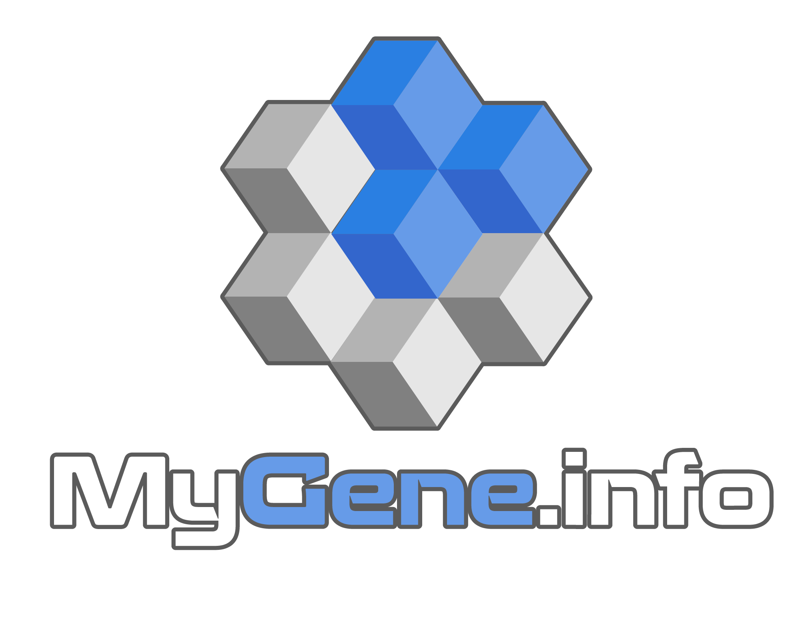

.. MyGene.info documentation master file, created by
   sphinx-quickstart on Wed May 29 17:15:29 2013.
   You can adapt this file completely to your liking, but it should at least
   contain the root `toctree` directive.

MyGene.info documentation
*************************

Introduction
-------------

.. cssclass:: head-paragraph

  `MyGene.info <http://mygene.info>`_ provides simple-to-use REST web services to query/retrieve gene annotation data. It's designed with **simplicity** and **performance** emphasized. A typical use case is to use it to power a web application which requires querying genes and obtaining common gene annotations. For example, `MyGene.info <http://mygene.info>`_ services are used to power `BioGPS <http://biogps.org>`_.

.. raw:: html

    
    

    
    

    

.. raw:: html

    

    <a class="twitter-timeline" Width="100%" height="400px" data-chrome="noborders nofooter transparent noscrollbar" href="https://twitter.com/mygeneinfo" data-widget-id="372882575196299264">Tweets by @mygeneinfo</a>
    

What's new in v3 API
------------------------

* Refseq accession number now contains version
* "ensembl", "refseq" and "accession" contains associations between RNA and protein
* Better mapping between Ensembl and Entrez gene IDs
* JSON structure slightly changed
* and more bugfixes

You can read more details about this version on our `blog <http://mygene.info/mygene-info-v3-is-out>`_

`Migration guide from v2 to v3 API <doc/migration_from_v2.html>`_

Still want to stick with v2 API for a while? It's still there: `v2 API <http://mygene.info/v2/doc>`_, but annotation data there won't be updated any more.

.. include :: doc/quick_start.rst

Documentation
---------------------

.. toctree::
   :maxdepth: 3

   Try it live on interactive API page <http://mygene.info/v3/api>
   doc/migration_from_v2
   doc/data
   doc/release_changes
   doc/query_service
   doc/annotation_service
   doc/usage_demo
   doc/packages
   terms

How to cite
------------

See citation page here: http://mygene.info/citation/

FAQ
-------

See FAQ page here: http://mygene.info/faq/

Related links
-------------

* `mygene.info on Github <https://github.com/SuLab/mygene.info>`_

Contact us
-------------------------

* help@mygene.info
* `@mygeneinfo <https://twitter.com/mygeneinfo>`_

.. raw:: html

    

.. Indices and tables
.. ==================

.. * :ref:`genindex`
.. * :ref:`modindex`
.. * :ref:`search`
